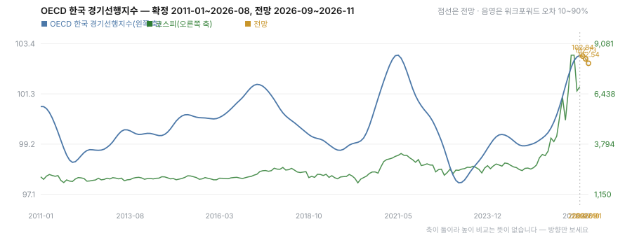

# R09 0·1·2단계 — 선행지수 2~3개월 전망 (2026-09-12)

계획: [guides/research-candidates-plan.md](../../../guides/research-candidates-plan.md) R09.
도구: `tools/run_cli_forecast.py`(1·2단계), `data_sources/oecd.py`의 `append_cli_vintage`(0단계).

## 0단계 — 판본 보관을 켰다

선행지수는 나중에 값이 바뀌고 특히 끝자락 몇 달이 크게 바뀐다. 그런데 우리는 최신본 한 벌만
덮어쓰며 보관해 왔다. 그래서 **오늘 하는 백테스트는 그 시점에 알 수 없던 개정을 미리 아는 셈**이고
성적이 부풀려져 있다. 아래 1·2단계 결과는 모두 그 한계를 안고 있다.

오늘부터 `macro_history/cli_g20_vintages.csv`에 (받은 날, 달, 값)으로 쌓는다. 끝자락 18개월만
남긴다 — 오래된 달은 사실상 바뀌지 않아 같은 값을 다시 적을 뿐이다. 같은 날 두 번 돌거나 값이
그대로면 판본을 늘리지 않는다. 영업이익 잡이 선행지수를 새로 받은 날 함께 남기고, 실패해도
보고서를 멈추지 않는다.

## 1단계 — 임의보행인가

G20 선행지수 2000-01~2026-08, 320개월.

| 항목 | 값 |
| --- | --- |
| 월 변화 표준편차 | 0.4727 |
| 변화의 자기상관 1개월 | +0.49 |
| 2~6개월 | +0.07, −0.08, −0.12, −0.06, −0.02 |

분산비(1이면 임의보행, >1이면 추세):

| q | VR | z (이분산 허용) | z (등분산 가정) |
| --- | --- | --- | --- |
| 2 | 1.499 | +1.42 | +8.92 |
| 3 | 1.724 | +1.42 | +8.67 |
| 6 | 1.787 | +1.05 | +5.69 |
| 12 | 1.655 | +0.72 | +3.12 |

**두 통계량이 엇갈린다.** 등분산을 가정하면 임의보행이 압도적으로 기각되고, 이분산을 허용하면
네 구간 모두 기각하지 못한다(|z| < 1.96). 차이가 여섯 배에 이르는 것은 이 계열의 분산이 몇 달에
몰려 있다는 뜻이다 — 2008년과 2020년이다. 그 몇 달이 이분산 분산 추정을 지배해 통계량을 눌러 버린다.

읽는 법: **평시에는 관성이 뚜렷하지만(1개월 자기상관 +0.49, VR 1.5~1.8) 위기 몇 달 때문에
"임의보행이 아니다"를 통계적으로 주장할 수는 없다.** 계획은 임의보행이면 멈추라고 했는데 여기서는
판정이 갈리므로 멈추지 않고 2단계로 갔다. 다만 기대치는 낮춰 잡았다.

### 실행 중 고친 결함

분산비의 delta(j)에 표본 수를 한 번 더 곱하고 있었다. delta 는 분모가 제곱합의 제곱이라 그 자체로
1/n 크기인데 여기에 n 을 또 곱하면 theta 가 n 배가 되고 z 는 sqrt(n)≈17.9배 작아진다. 처음 실행에서
z 가 +0.08 로 나와 "임의보행"으로 읽을 뻔했다. 등분산 통계량을 나란히 내도록 바꿔 두 값이 수십 배
어긋나면 바로 드러나게 했고, 그 사실을 회귀 테스트로 고정했다.

## 2단계 — 전망 (확장 창 워크포워드, 첫 학습 120개월, 시차 2, 부트스트랩 2000)

후보는 ARIMA(2,1,0)과 VAR(2)다. VAR 의 동반 계열은 국내 선행지수와 로그 반도체 수출이고, 국내
지수가 2013년부터라 표본이 136~138건으로 짧다. 이동평균 항은 새 의존성이 필요해 넣지 않았다.

평균절대오차(지수 포인트)와 기준선 대비 쌍체 차이:

| 지평 | rw | drift | ar | var |
| --- | --- | --- | --- | --- |
| 1개월 | 0.1721 | **0.0988** | 0.0985 | 0.3024 |
| 2개월 | 0.3049 | 0.2661 | **0.2587** | 0.6555 |
| 3개월 | **0.4321** | 0.4706 | 0.4872 | 0.9567 |

- **1개월**: `drift`(마지막 변화 그대로)가 `rw` 를 이긴다(−0.0733 [−0.1347, −0.0099]). `ar` 은 `rw`
  와도 `drift` 와도 동률이다(vs drift −0.0003 [−0.0256, +0.0248]). 즉 AR 이 하는 일은 사실상
  "마지막 변화를 그대로 민다"이고 그 이상은 없다.
- **2개월**: 네 모형 모두 서로 동률이다.
- **3개월**: 모두 동률이고 `var` 는 `rw`·`drift` 둘 다에 유의하게 열위다(+0.4049 [+0.0318, +0.9086]).
- `var` 는 세 지평 모두에서 `drift` 에 열위다. 동반 계열을 넣으면 잡음만 늘었다.

## 전망값 (마지막 확정 2026-08, 100.2968)

"채택 없음"은 **새 모형을 안 쓴다**는 뜻이지 숫자를 못 낸다는 뜻이 아니다. 이긴 것이 기준선이므로
기준선으로 낸다. 어느 기준선을 쓸지는 규칙으로 정한다 — 기본은 단순한 `rw`(마지막 값 그대로)이고
`drift`(마지막 변화 그대로)가 유의하게 이긴 지평에서만 바꾼다. 성적 순위로 고르면 고른 표본에서
성능을 보고하는 셈이라 편향된다(분기 이익 모형과 같은 규칙).

| 달 | 지평 | 전망 | 구간(오차 10~90%) | 채택 | 참고: ARIMA | 참고: VAR |
| --- | --- | --- | --- | --- | --- | --- |
| 2026-09 | 1개월 | **100.293** | 100.236 ~ 100.323 | drift | 100.293 | 100.034 |
| 2026-10 | 2개월 | **100.297** | 99.981 ~ 100.518 | rw | 100.290 | 99.704 |
| 2026-11 | 3개월 | **100.297** | 99.841 ~ 100.630 | rw | 100.286 | 99.509 |



읽는 법: **앞으로 석 달 동안 거의 움직이지 않는다는 전망이다.** 지수는 100 근처의 매우 평탄한
구간에 있고(최근 12개월 변화 ±0.06), 어떤 모형도 그 평탄함을 넘어서는 신호를 찾지 못했다.
구간은 이론 분포가 아니라 워크포워드에서 그 모형이 실제로 빗나간 폭의 10~90% 분위다. 3개월
지평의 구간이 ±0.4 로 넓은 것이 이 전망의 실제 정밀도다.

ARIMA 는 세 지평 모두 기준선과 소수점 둘째 자리까지 같다 — 앞서 "AR 이 하는 일은 사실상 마지막
변화를 그대로 미는 것"이라고 한 말이 숫자로도 그대로 나타난다. VAR 만 아래로 크게 벗어나는데
(3개월 99.51), 그 방향이 맞다는 근거는 없고 워크포워드에서 세 지평 모두 열위였다.

## 판정

**채택 없음.** ARIMA 도 VAR 도 기준선을 이기지 못했다. 유일하게 무언가를 이긴 것은 기준선 자체인
`drift` 이고 그것도 1개월에서만이다. 2~3개월 지평에서는 어떤 모형도 "마지막 값 그대로"보다 낫지 않다.

**3단계(다음 분기 이익 모형에 얹기)는 진행하지 않았다.** 계획의 조건은 "2단계를 통과한 전망만"이다.
통과한 것이 없으므로 얹을 것이 없다. 굳이 얹는다면 `drift` 인데, 그것은 이미 이익 모형이 쓰는
`cli_change_3m` 이 담고 있는 정보와 같은 것이라 새로 더할 것이 없다.

## 한계

- **개정을 무시했다.** 최신본 한 벌로 쟀으므로 위 성적은 실제보다 좋다. 나쁜 쪽으로 틀렸을 가능성은
  낮지만(좋게 부풀려지는 방향이다), 정확한 크기는 판본이 쌓여야 안다. 0단계를 켠 이유다.
- 이동평균 항(ARIMA 의 q)을 시험하지 않았다. statsmodels 를 넣어야 하는데, AR 이 기준선과 동률인
  마당에 MA 를 더해 뒤집힐 여지는 크지 않다고 보고 의존성을 늘리지 않았다.
- 시차는 2로 고정했다. 변화의 자기상관이 2개월 이후 사실상 0이라 더 긴 시차를 줄 근거가 없다.
- 잠금 구간은 쓰지 않았다. 개발 단계에서 통과하지 못했으므로 열 이유가 없다.

## 재현

```powershell
$env:PREDICT_STOCK_PUBLISH = 'false'
python tools/run_cli_forecast.py --out runs/cli_forecast
```

결과는 `scores.csv`(지평 3 × 모형 4)와 `diagnostics.json`에 있다.
